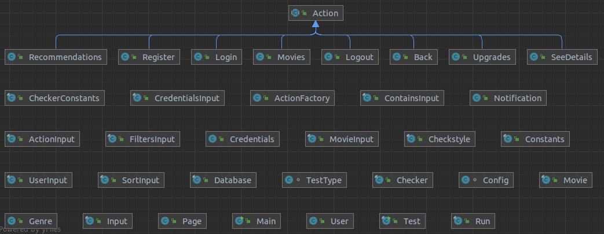

# Tema POO  - POO TV

### Name: Vladimir Bucur
### Grupa: 321CA

## Description:
This program simulates a platform for viewing movies or series similar to Netflix, HBO GO, etc.
This is called POO TV and it receives in the command line commands that the user wants to do.

## Implementation
In the implementation of this program I used several classes that are grouped in several packages:
- ***fileio classses***: here are classes that help to take the Json type data received
at the input so that they can later be used in the program.
- ***entities***: 
  - *Credentials*: the class contains the credentials of a user
  - *Genres*: the class contains the the genres of a movie (the name and the genre's number of likes)
  - *Movie*: the class that contains specific fields and methods for a movie
  - *Notification* the class that contains the movie name and the notification's message
  - *Page*: the class that contains specific fields and methods for a page
  - *User*: the class that contains specific fields and methods for a user
- ***actions***: here is a basic class that describes an action itself and other classes that
contain methods for implementing actions grouped in classes with the name of the page where
they are performed
- ***pootv***:
  - *Database*: the class that contains the database itself (users and movies received as input),
  but also methods for each type of page where the actions are executed
  - *Run*: the class where the input given in the command line is received and depending on
  the command that is received calls the functions that solve them

## Program Logic
In the Main method there is an entry point in the run method of the Run class. There are
verifications for what command is given on the input and apply methods that resolve that command.

In the "actions" package there is an abstract class
"Action" which is invoked by all other classes in the package. In these, the abstract method
"actionOutput" is implemented, which returns an ObjectNode that is later used to display data
at the output. In addition, these classes also have methods for certain checks but also for
carrying out the actions themselves.

In the "Database" class, instances of the classes described above are created and the functions
are called to perform the actions on that page, but also the "change page" type actions,
if this is possible. Thus, here, in addition to the users and the movies received at the input
and stored in the database, there is also a method for each page.

## Patterns
1. Since the Run and PooTv classes must be instantiated only once, I used the Singleton Pattern
with Lazy instantiation.

2. Because there are several classes that inherit the abstract class Action and they are instantiated
each separately, I chose to use the Factory Pattern

3. In order to easily implement the action of notifying users in case of update operations of the movie
database (every time a movie is added or deleted in the database (Observable) there is a list
of users (Observer) who are notified of these changes), I chose to use the Observer model.

4. Becouse the Movie class would have many constructors, we chose a more flexible solution to creating
complex objects using the Builder Pattern

## Skel Structure

## GitHub repository link:
- https://github.com/vladimirbucur/POO-TV